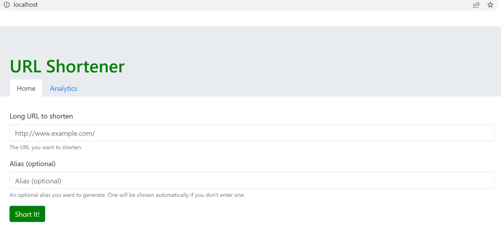
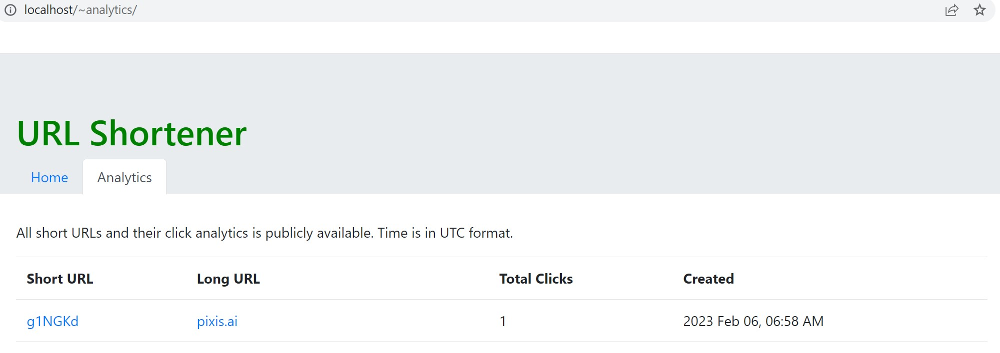
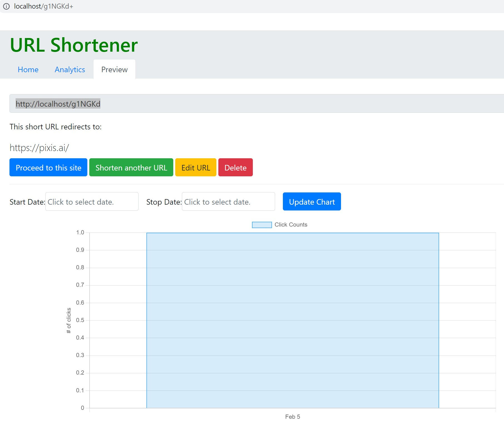

# Link Shortener

## Images
 





## Used Technologies
- Python
- Django
- Docker and Docker Compose
- Nginx and Gunicorn
- PostgresQL
- HTML, CSS, and Bootstrap
- JavaScript and jQuery
- ChartJS

## Useful Docker Commands

### Building
Development:
```bash
docker-compose up
```
### Following Logs
Development:
```bash
docker-compose -f docker-compose.yml logs -f
```
### Migration
In development migration are applied automatically in `entrypoint.sh`.